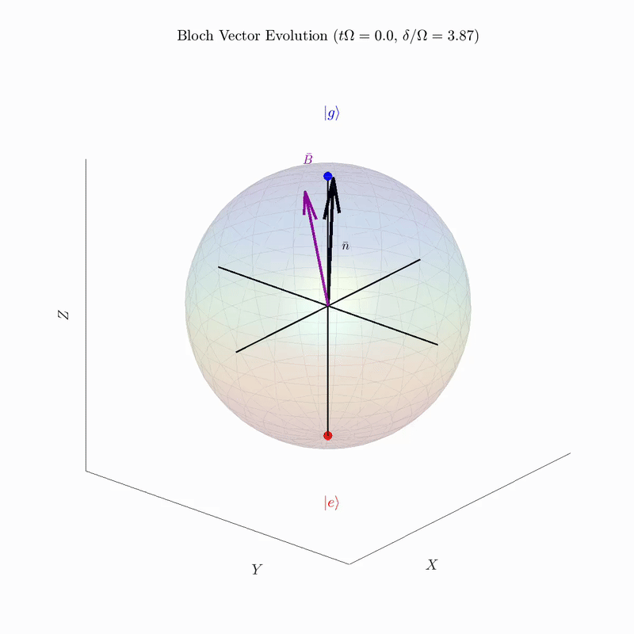
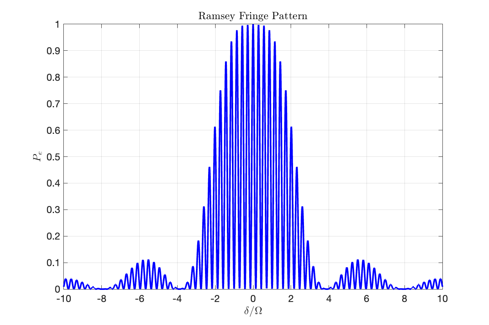

# Ramsey Sequence Bloch Sphere Simulation

**MATLAB simulation visualizing Bloch vector evolution during a Ramsey sequence for quantum coherence measurement**

## Purpose
Demonstrates **Ramsey interferometry** - a cornerstone technique for **quantum coherence measurement**:

1. **First π/2 pulse** → Creates **coherent superposition** |g⟩ + |e⟩
2. **Free evolution** → **Phase accumulation** δ·t due to detuning
3. **Second π/2 pulse** → **Converts phase to population** Pₑ interference result

---

## Ramsey Fringe Pattern

**Interference pattern** Pₑ vs free evolution time T_wait:
